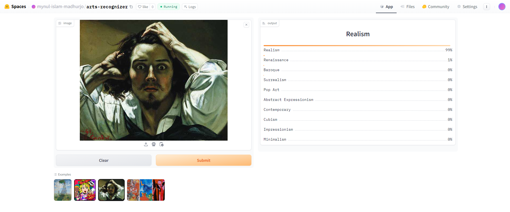

# Art-Recognizer
An image classification model from data collection, cleaning, model training, deployment and API integration.  
The model can classify 10 different types of arts  
The types are following:  
1. Cubism
2. Impressionism
3. Surrealism
4. Abstract Expressionism
5. Realism
6. Pop Art
7. Minimalism
8. Contemporary
9. Renaissance
10. Baroque

# Dataset Preparation
**Data Collection:** Downloaded from DuckDuckGo using term name  
**DataLoader:** Used fastai DataBlock API to set up the DataLoader.  
**Data Augmentation:** fastai provides default data augmentation which operates in GPU.  
Details can be found in `notebooks/Art_Recognizer.ipynb`

# Training and Data Cleaning
**Training:** Fine-tuned a resnet34 model for 5 epochs and got upto ~94% accuracy.  
**Data Cleaning:** This part took the highest time. Since I collected data from browser, there were many noises. Also, there were images that contained. I cleaned and updated data using fastai ImageClassifierCleaner. I cleaned the data each time after training or finetuning, except for the last time which was the final iteration of the model.  

# Model Deployment
I deployed to model to HuggingFace Spaces Gradio App. The implementation can be found in `deployment` folder or [here](https://huggingface.co/spaces/mynul-islam-madhurjo/arts-recognizer).  

# API integration with GitHub Pages
The deployed model API is integrated [here](https://mynul-islam-madhurjo.github.io/Art-Recognizer/) in GitHub Pages Website. Implementation and other details can be found in `docs` folder.

